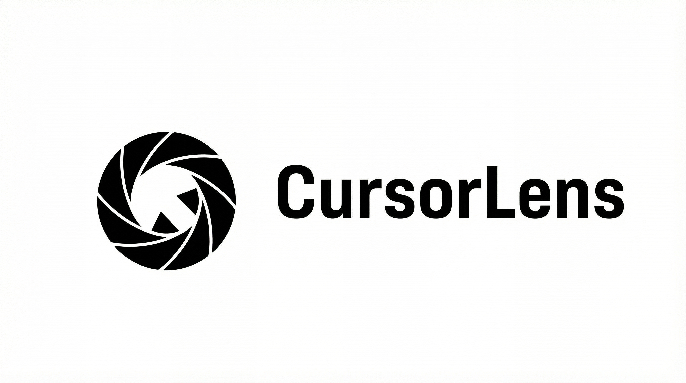

> [!WARNING]
> CursorLens is still in beta and some workflows may be unstable on specific machines.

[简体中文](./README.zh-CN.md)

<p align="center">
  
  <br />
  <a href="https://github.com/blueberrycongee/CursorLens">
    
  </a>
  <a href="http://www.lelekawaii.com/CursorLens/">
    
  </a>
</p>

# <p align="center">CursorLens</p>

<p align="center"><strong>CursorLens is a free, open-source screen recorder and editor for creators, developers, and teams making product demos and walkthrough videos.</strong></p>

CursorLens is built on top of the excellent [OpenScreen](https://github.com/siddharthvaddem/openscreen) foundation and significantly upgraded for a stronger macOS-native capture and editing workflow.

<p align="center">
  
  
  
  
</p>

## Core Features

- Record full screen or a selected app window.
- Native macOS capture helper with native cursor hide/show capture behavior.
- Camera overlay capture on the native recording pipeline.
- Microphone voice recording with editor-side gain adjustment.
- Timeline editing: trim, crop, zoom, cursor effects, and annotations.
- Subtitle generation and rough-cut workflow in editor.
- Multi-aspect export (16:9, 9:16, 1:1 and more), including batch export.
- Export audio controls: track toggle, gain, loudness normalization, limiter.
- Recording UX controls: countdown, auto-hide launcher, customizable stop shortcut, permission diagnostics.

## Installation

Download the latest installer for your platform from [GitHub Releases](https://github.com/blueberrycongee/CursorLens/releases).

### macOS

If macOS Gatekeeper blocks an unsigned build, or you see "CursorLens is damaged and can't be opened", run:

```bash
xattr -rd com.apple.quarantine "/Applications/CursorLens.app"
```

Then grant required permissions in **System Settings -> Privacy & Security**:

- Screen Recording (or Screen & System Audio on newer macOS)
- Accessibility
- Microphone (for voice recording)
- Camera (for camera overlay)

### Linux

Download the `.AppImage` from releases and run:

```bash
chmod +x CursorLens-Linux-*.AppImage
./CursorLens-Linux-*.AppImage
```

## Development

### Requirements

- Node.js 20+
- npm 10+
- macOS + Xcode Command Line Tools (for native helper build)

### Run

```bash
npm install
npm run dev
```

### Build

```bash
npm run build
```

## Built With

- Electron
- React
- TypeScript
- Vite
- PixiJS
- dnd-timeline

## Contributing

Contributions are welcome through issues and pull requests.

- Issues: [https://github.com/blueberrycongee/CursorLens/issues](https://github.com/blueberrycongee/CursorLens/issues)
- Discussions: [https://github.com/blueberrycongee/CursorLens/discussions](https://github.com/blueberrycongee/CursorLens/discussions)

## Acknowledgements

- Upstream project: [siddharthvaddem/openscreen](https://github.com/siddharthvaddem/openscreen)

## License

This project is licensed under the [MIT License](./LICENSE).
